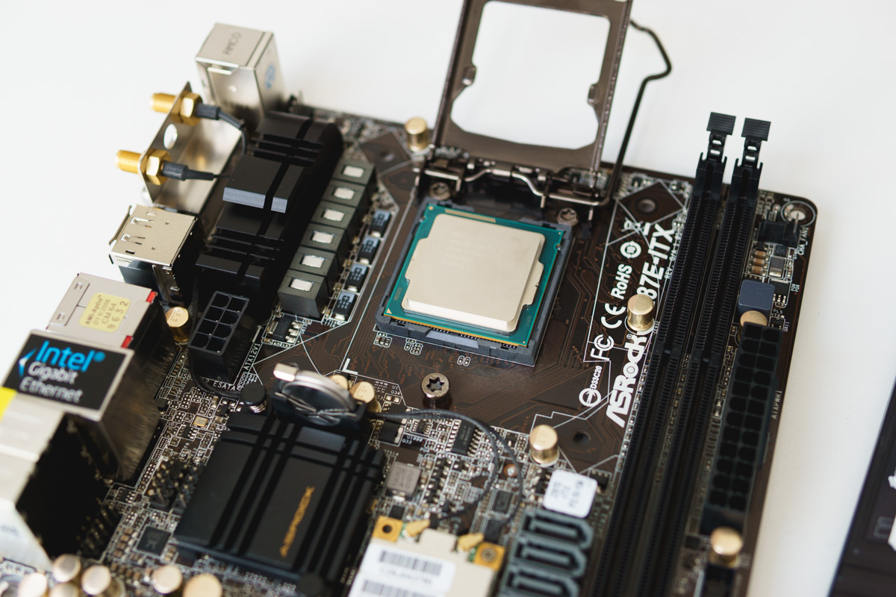
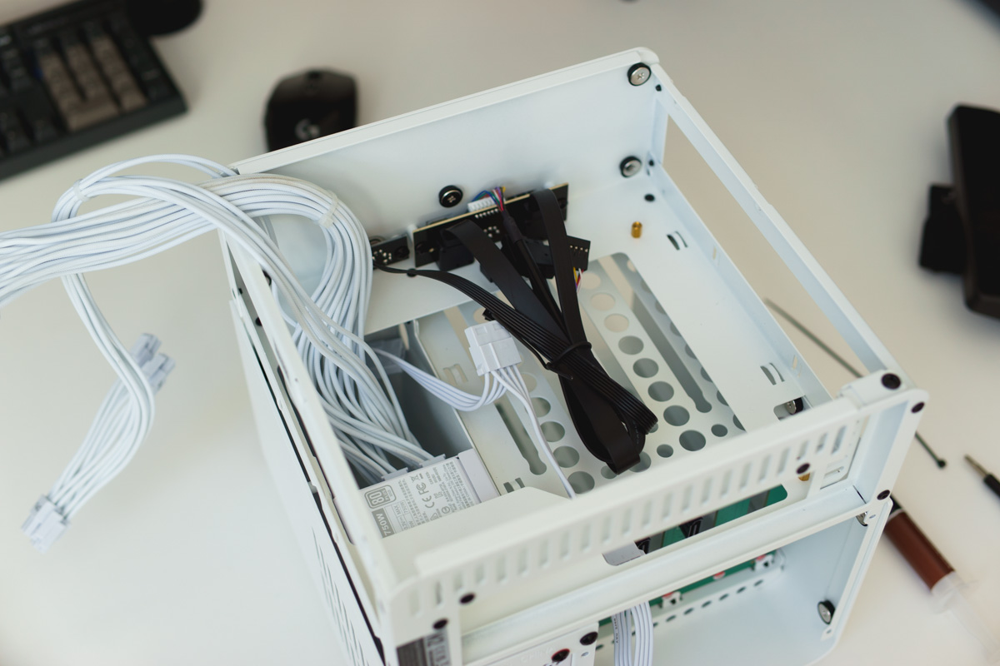
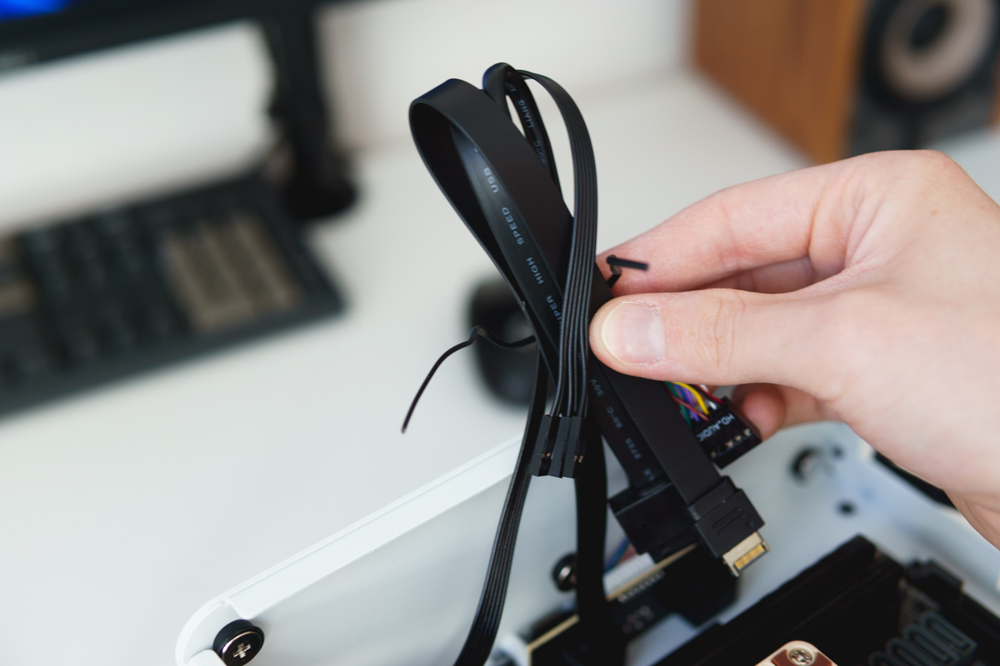

# €700 NAS build guide
{: .no_toc }

[Full size](header.jpg)
{: .fs-1 }

I wanted to build a NAS and Minecraft server. The storage is mainly going to be used for Blu-Ray rips and torrents.

## Table of contents
{: .text-delta .no_toc }

1. TOC
{:toc}

----

## Components

| Component   | Name                                                        |
| :---------- | :---------------------------------------------------------- |
| Case        | Jonsbo N2 White                                             |
| Motherboard | Asrock Z87E-ITX                                             |
| CPU         | Intel Core i5 4670K                                         |
| Cooler      | Noctua NH-L9i                                               |
| RAM         | 8GB DDR3                                                    |
| PSU         | Lian Li SP750 White                                         |
| Storage     | Kingston SDNow mS200 120GB 4x WD Red Plus 4TB (WD40EFRX) |

**The case**  
The case is the Jonsbo N2 in white. It has room for five 3.5" hard drives, and supports both SATA and SAS. These drives are connected to a backplane that connects the drives to the motherboard and supplies power via molex. I chose this case for its compact size, good build quality and sleek design.

**The CPU, RAM, and motherboard**  
I found a good deal on Marktplaats (the Dutch version of eBay) for a used PC. It has an i5 4670K, 8 GB of DDR3, an Asrock Z87E-ITX and a Blu-Ray drive. It's built in a Cooler Master N200 which I won't use.

The motherboard is the best part of this setup: it has an mSATA slot on the back, which will allow me to install a small boot drive. I can also use it for hosting the Minecraft server with the speed on an SSD, although not quite the speeds on a modern NVMe drive. This board also has **six** SATA ports, which makes it perfect for the Jonsbo N2.

**Other components**  
I got the power supply used on Marktplaats for a good price. And it's white, which will match the case quite well. SFX power supplies have increased in price a TON over the last few years, which is why I didn't opt for a new one.

The CPU cooler is a Noctua NH-L9i. I chose this because I love Noctua products, and because it fits in the low clearance of the case. There's also a Noctua NF-A12x15 PWM which replaces the standard fan for the hard drive bay.

**Future upgrades**  
As for possible upgrades in the future: one good upgrade would be a low-profile 10Gb network card. Another likely upgrade would be to find 2x8GB sticks of DDR3, totaling 16 GB. Both Minecraft (especially recent versions) and ZFS require a lot of RAM.

## Required tools

[Full size](img/DSC00383.jpg)
{: .fs-1 }

To build a pc, you'll at least need the following things:  
- A screwdriver
- Some zip ties
- Side cutters (for zip ties)
- A knife (for unboxing things)
- Thermal paste

In this particular case, we'll need philips 1, 2 and hex 2 mm bits. The hex bit is required to take off the top panel of the Jonsbo N2. This is usually not required in most cases. For the knife, I am using my good ol' Spyderco Para 3 Lightweight in MagnaCut. Thermal paste will usually come with a cooler, either pre-applied or in a tube.

## Step 1: Preparing the motherboard

Start off by preparing the motherboard, so we can put this in the case afterwards. Installing all components onto the motherboard first is recommended, as installing them when the motherboard is already in the case can be tricky, or even impossible. In this case, we have to install the cooler _before_ putting the motherboard in the case, as there's no access to the back of the board.

[Full size](img/DSC00384.jpg)
{: .fs-1 }

In the image above, you can see the motherboard itself, the CPU, RAM and I/O shield. The I/O shield goes in the case. Start off by lifting the _Integrated Lever Mechanism_ or ILM on the CPU socket. If your board is new, it will have a plastic cover on it, which you should leave on. You'll want to be _VERY_ careful with the socket, as there are literaly over a thousand tiny pins in there that can easily bend or break off. Don't ever drop anything in there or try to touch it.

### CPU

[Full size](img/DSC00390.jpg)
{: .fs-1 }

Now, find the golden triangle on the bottom left of the CPU. Align this with the angled corner of the socket, so you know you're installing it the right way. Put the CPU into the socket very gently, without putting any pressure on it.

[Full size](img/DSC00393.jpg)
{: .fs-1 }

When you're sure it's in right, take the lever again and pull it down. This will require some force, and you may hear some crunching noises. This is completely normal.

[Full size](img/DSC00402.jpg)
{: .fs-1 }

Congratulations! The scariest part is now finished. You've successfully installed a CPU!

[Full size](img/DSC00404.jpg)
{: .fs-1 }

### RAM

Next up is the RAM. This is quite easy. Simply align the notch on the RAM with the notch on the motherboard, and stick it in (that's what she said). It should give a satisfying *\*click\**.

[Full size](img/DSC00406.jpg)
{: .fs-1 }

[Full size](img/DSC00409.jpg)
{: .fs-1 }

### CPU cooler

[Full size](img/DSC00410.jpg)
{: .fs-1 }

Now for the CPU cooler. In this case, we have a Noctua NH-L9i. Every cooler has its own mounting mechanism, so consult the manual that came with the cooler before doing anything else.

Start by applying a bit of thermal paste to the center of the CPU. Newer CPUs have larger integrated heat spreaders (the metal part of the CPU), so they'll require a bit more paste than this old i5 4670K. There's no real 'wrong' way to apply thermal paste: some people like to spread it out, others prefer the center dot method, as shown here. There's definitely too much and too little paste though, so be conservative with it. Just not _too_ conservative.

[Full size](img/DSC00412.jpg)
{: .fs-1 }

Now put on the cooler, and flip the board around to install the included screws and mount it.

[Full size](img/DSC00415.jpg)
{: .fs-1 }

[Full size](img/DSC00417.jpg)
{: .fs-1 }

[Full size](img/DSC00423.jpg)
{: .fs-1 }

Next, install the CPU fan by inserting the fan connector in the fan header, usually marked `CPU_FAN`. If it says `CHA_FAN` or `SYS_FAN`, it's for case fans. Some motherboards will also have a `PUMP_FAN` header, which is meant for the pump of all-in-one watercooling solutions.

[Full size](img/DSC00426.jpg)
{: .fs-1 }

### mSATA SSD

Install the mSATA SSD by inserting it in the slot on the back. This is also keyed, so there's no wrong way to do it.

[Full size](img/DSC00428.jpg)
{: .fs-1 }

Great, now we've finished preparing the motherboard for installation into the case!

[Full size](img/DSC00432.jpg)
{: .fs-1 }

## Step 2: Preparing the case

To install the motherboard and the rest of the components in the case, take off the side panels first.

[Full size](img/DSC00434.jpg)
{: .fs-1 }

[Full size](img/DSC00435.jpg)
{: .fs-1 }

### Power supply

The best thing to start with is the power supply, especially in smaller cases like these. It's also not a bad idea to attach the cables you need _before_ you put the power supply in the case, as attaching them later can be very difficult.

Screw in the power supply to the bracket of the case, keeping in mind the orientation of the fan.

[Full size](img/DSC00437.jpg)
{: .fs-1 }

[Full size](img/DSC00443.jpg)
{: .fs-1 }

[Full size](img/DSC00444.jpg)
{: .fs-1 }

Plug in the Molex connectors to the backplane of the hard drive cage, which will power the hard drives. It's also recommended to pre-route the SATA cables. These transfer data to the motherboard.

[Full size](img/DSC00447.jpg)
{: .fs-1 }

[Full size](img/DSC00449.jpg)
{: .fs-1 }

### Putting in the motherboard

_BEFORE_ you do anything else, make sure you install the I/O shield first. A lot of PC builders have forgotten this step at one point, causing a lot of frustration later on. You'll know you've installed it correctly when you hear a nice *\*click\**, and all four sides are flush with the case.

[Full size](img/DSC00450.jpg)
{: .fs-1 }

Now put in the motherboard by sort of 'sliding' it in diagonally to avoid the motherboard standoffs in the case, but also aligning the motherboard I/O with the I/O shield. Then, locate the standoffs, and make sure the motherboard is aligned correctly by double checking whether you can see the threads of the standoffs through the corresponding holes of the board.

[Full size](img/DSC00454.jpg)
{: .fs-1 }

[Full size](img/DSC00456-1.jpg)
{: .fs-1 }

Screw in the appropriate screws into the standoffs. The manual of the case will likely tell you which ones you need.

[Full size](img/DSC00457.jpg)
{: .fs-1 }

### Front I/O

The next part is one of the tricker parts as well. Start by locatingthe front I/O cables and separating them. THese will likely include USB 3.0 (type A), USB type C, HD audio and some small wires for the power/reset button and activity LEDs.

[Full size](img/DSC00460.jpg)
{: .fs-1 }

Let's start with the easy one: USB 3.0 (type A). This is quite a large connector, and note that it is keyed with a little notch. It's also missing a pin that corresponds with a missing pin on the motherboard's USB 3.0 header. Simply plug it in, and you're done!

This motherboard does not have a USB type C header, so we won't be using it here. If your motherboard doesn't have this header and you'd still like to use the USB type C port on the case, trhere are various adapters and expansion cards you can get to resolve that.

[Full size](img/DSC00463.jpg)
{: .fs-1 }

[Full size](img/DSC00465.jpg)
{: .fs-1 }

Next up: HD audio. This connector looks a bit more dated, but it's only keyed by a missing pin. You'll usually find the connector along the bottom left of the board.

[Full size](img/DSC00467.jpg)
{: .fs-1 }

[Full size](img/DSC00469.jpg)
{: .fs-1 }

Now for the hard part: the power/reset button and LEDs. You'll find the connectors for these along the bottom right of the board. Note that these little guys have positive and negative side. The positive side is indicated by a small arrow. In this case, the motherboard has the layout of the pins printed right on it, but that's not always the case. If you're not sure, please consult the motherboard's manual.

[Full size](img/DSC00471.jpg)
{: .fs-1 }

[Full size](img/DSC00473.jpg)
{: .fs-1 }

[Full size](img/DSC00475.jpg)
{: .fs-1 }

### Power cables

After you've finished installing the front I/O connectors, your components will need some power. Start by plugging in the 24-pin ATX connector into the motherboard. It's the big connector, impossible to miss. Then plug in the 8-pin connector for the CPU.

[Full size](img/DSC00478.jpg)
{: .fs-1 }

[Full size](img/DSC00480.jpg)
{: .fs-1 }

Route your cables nicely, and appreciate the work you've done so far. You're almost there!

[Full size](img/DSC00485.jpg)
{: .fs-1 }

### SATA cables

Now plug in the SATA cables, keeping track of which one goes where. The motherboard's manual will tell you which SATA ports are which. Note that, because we have an mSATA SSD installed, the **second** SATA port closest to the CPU, labeled `SATA3_4`, is no longer functional. In this case, the port closest to the CPU (`SATA3_5`) is also shared with the eSATA port.

[Full size](img/DSC00487.jpg)
{: .fs-1 }

Now, tidy up the SATA cables a bit.

[Full size](img/DSC00490.jpg)
{: .fs-1 }

## Step 3: Installing the hard drives

First, don't forget to plug in the rear fan into the backplane's header, or in my case, the motherboard. This choice is up to you, but the motherboard's header will allow you to control the fan manually, rather than having it run at full speed all the time.

[Full size](img/DSC00493.jpg)
{: .fs-1 }

Prepare the hard drives first by putting on the rubber pieces that come with the case. Do this for all of your hard drives, and slide them into the hard drive cage.

[Full size](img/DSC00496.jpg)
{: .fs-1 }

[Full size](img/DSC00497.jpg)
{: .fs-1 }

[Full size](img/DSC00499.jpg)
{: .fs-1 }

## Step 4: Done!

That's it! You have successfully built a computer. The next step is to make sure everything is working and detected. Make sure the power is plugged in and the power supply is turned on, then hit the power button. If you see a POST screen (usually the motherboard logo), that's good news!