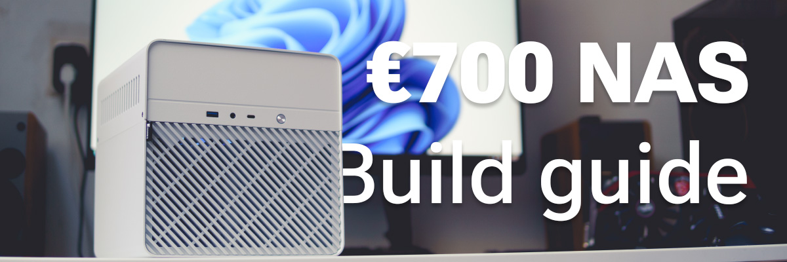

[Full size](700-nas-build_header.jpg)
{: .fs-1 }

# €700 NAS build
{: .fw-700 .no_toc }

I wanted to build a NAS and Minecraft server. The storage is mainly going to be used for Blu-Ray rips and torrents.

## Table of contents
{: .text-delta .no_toc }

1. TOC
{:toc}

----

## Components

<dl>
  <dt>Case</dt>
  <dd>Jonsbo N2 White</dd>
  <dt>PSU</dt>
  <dd>Lian Li SP750 White</dd>
  <dt>Cooler</dt>
  <dd>Noctua NH-L9i</dd>
  <dt>CPU</dt>
  <dd>Intel Core i5 4670K</dd>
  <dt>GPU</dt>
  <dd>Integrated graphics</dd>
  <dt>RAM</dt>
  <dd>8GB DDR3</dd>
  <dt>Motherboard</dt>
  <dd>Asrock Z87E-ITX</dd>
  <dt>Storage</dt>
  <dd>1x Kingston SSDNow mS200 120GB 4x WD Red Plus 4 TB (WD40EFRX)</dd>
</dl>

**The case**  
The case is the Jonsbo N2 in white. It has room for five 3.5" hard drives, and supports both SATA and SAS. These drives are connected to a backplane that connects the drives to the motherboard and supplies power via molex. I chose this case for its compact size, good build quality and sleek design.

**The CPU, RAM, and motherboard**  
I found a good deal on Marktplaats (the Dutch version of eBay) for a used PC. It has an i5 4670K, 8 GB of DDR3, an Asrock Z87E-ITX and a Blu-Ray drive. It's built in a Cooler Master N200 which I won't use.

The motherboard is the best part of this setup: it has an mSATA slot on the back, which will allow me to install a small boot drive. I can also use it for hosting the Minecraft server with the speed on an SSD, although not quite the speeds on a modern NVMe drive. This board also has **six** SATA ports, which makes it perfect for the Jonsbo N2.

**Other components**  
I got the power supply used on Marktplaats for a good price. And it's white, which will match the case quite well. SFX power supplies have increased in price a TON over the last few years, which is why I didn't opt for a new one.

The CPU cooler is a Noctua NH-L9i. I chose this because I love Noctua products, and because it fits in the low clearance of the case. There's also a Noctua NF-A12x15 PWM which replaces the standard fan for the hard drive bay.

**Future upgrades**  
As for possible upgrades in the future: one good upgrade would be a low-profile 10Gb network card. Another likely upgrade would be to find 2x8GB sticks of DDR3, totaling 16 GB. Both Minecraft (especially recent versions) and ZFS require a lot of RAM.