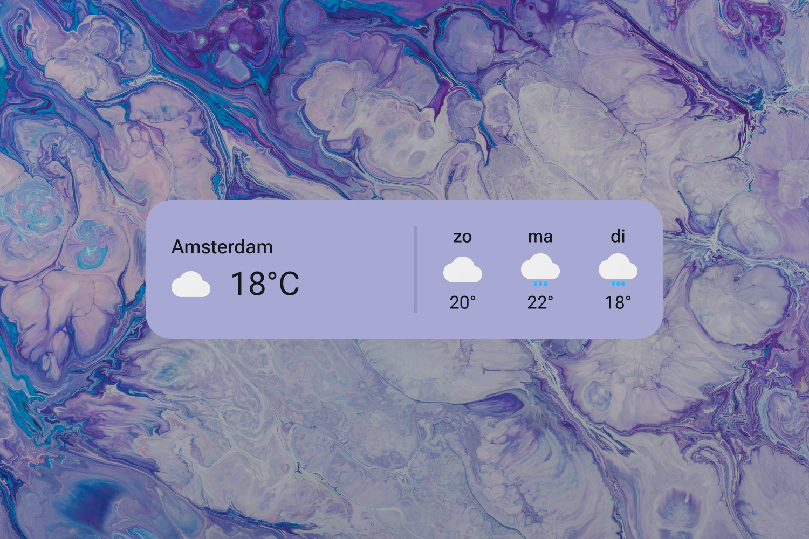

# Google Weather (JD Edition)

[Full size](header.jpg)
{: .fs-1 }
[DeviantArt](https://www.deviantart.com/adriaanjelle/art/Google-Weather-JD-Edition-Updated-2024-06-17-983724257){: .btn .btn-primary}

I saw [this](https://www.deviantart.com/fivetwofoureight/art/Google-Weather-5-0-OUTDATED-more-info-below-613748355) skin on DeviantArt by fivetwofoureight, and I figured I'd remake it and update the weather parser.

As always, right-click the skin and hit "Settings..." to change the settings.

----

## Installation

1. Download and install the latest version of [Rainmeter](https://www.rainmeter.net/).  
2. Download the [skin](https://github.com/adriaanjelle/Google-Weather-JD-Edition/releases/latest) and open the .rmskin file (it should have a green raindrop icon).  
3. Done!
