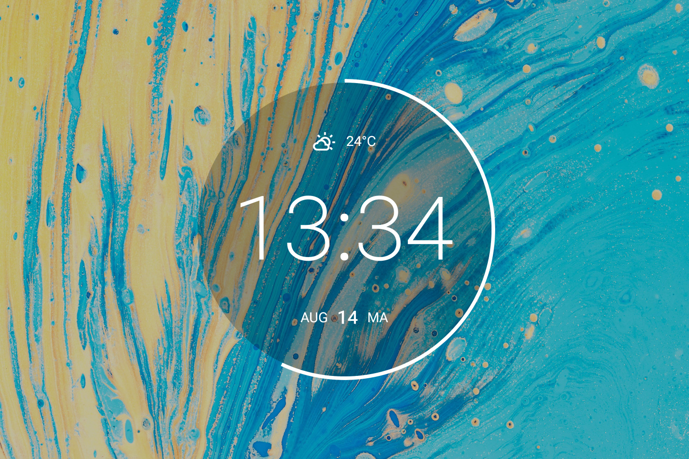

# Moto

[Full size](header.jpg)
{: .fs-1 }
[Download](https://github.com/adriaanjelle/Moto/releases/latest){: .btn .btn-primary .mr-2 }
[DeviantArt](https://www.deviantart.com/adriaanjelle/art/Moto-Updated-2024-06-17-983724004){: .btn }

This is a recreation of the Android widget found on Motorola devices. There are various options for the outer circle.

As always, right-click and hit "Settings..." to change the settings.

----

## Installation

1. Download and install the latest version of [Rainmeter](https://www.rainmeter.net/).  
2. Download the [skin](https://github.com/adriaanjelle/Moto/releases/latest) and open the .rmskin file (it should have a green raindrop icon).  
3. Done!
